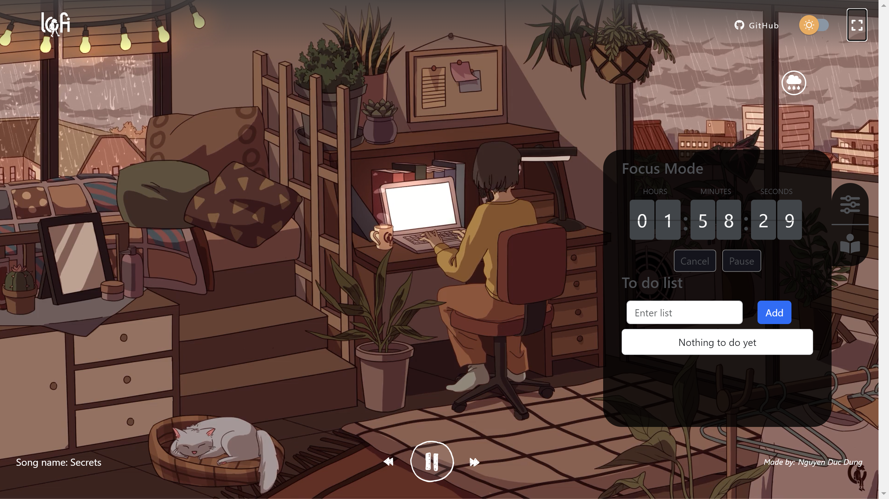
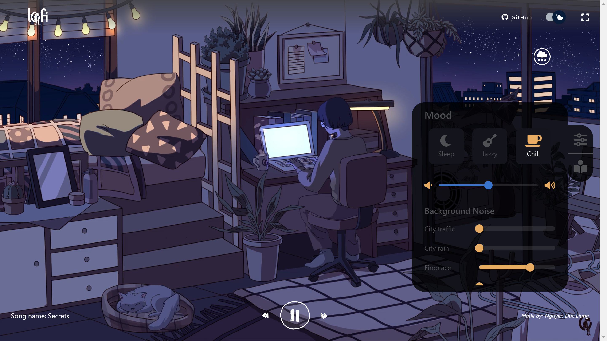

# Lofi Music Website

This project is a lofi music website built using React.js. It provides a soothing and relaxing experience for users who enjoy listening to lofi music. The website is designed to create a calming ambiance with its minimalistic and aesthetically pleasing interface.

## Features

- **Music Player**: The website includes a music player that allows users to play, pause, skip, and control the volume of the lofi music tracks.

## Installation

1. Clone the repository
2. Navigate to the project directory
3. Install the dependencies: `yarn install`
4. Start the development server: `yarn start`
5. Open your browser and visit
